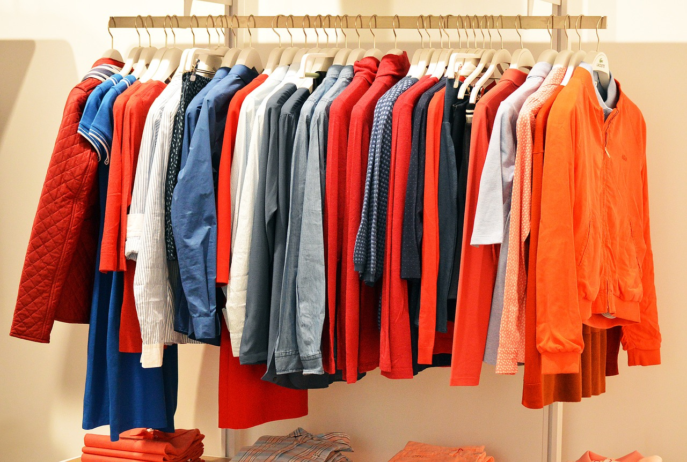

```{r setup, include=FALSE}
knitr::opts_chunk$set(echo = TRUE, fig.pos = 'H')
```

## Contexto

Los datos obtenidos se han recolectado en el supuesto de una empresa de retail en el mundo de la moda que pretende analizar otras compañías que lo están haciendo bien, para poder obtener indicadores de éxito. Así, se ha seleccionado esta web, La Tienda de Valentina, que ha tenido un crecimiento muy importante en los últimos años (ver las siguientes noticias: *[Noticia 1](https://www.eleconomista.es/valenciana/noticias/8292509/04/17/El-milagro-de-La-tienda-de-Valentina-de-200-euros-de-inversion-a-7-millones-en-ventas-en-2-anos.html)*, *[Noticia 2](https://elpais.com/economia/2018/08/09/actualidad/1533808607_176951.html)*).

Así, se ha decidido obtener dos datasets distintos, cada uno con distinta información. El primero de ellos es relativo a las distintas secciones del sitio, con el número de artículos y páginas por sección. El otro es relativo a los artículos de ropa presentes en el sitio web, con información de nombre, color, precio o descripción, entre otros.

## Imagen identificativa
Para identificar estos conjuntos de datos, se propone esta imagen:

```{r,echo=FALSE, fig.cap="Tienda de venta de ropa online", out.width = '45%', fig.align="center"}

```


## Título del dataset
Los dos datasets seleccionados tienen los siguientes títulos:

* Secciones  
* Artículos 

## Descripción
A continuación, se describen brevemente los conjuntos de datos obtenidos:

* Secciones: Este conjunto de datos contiene información sobre las distintas secciones que componen el sitio web. Para cada una, se especifican el número de artículos y el número de páginas. Esto permite hacerse una idea de la composición y organización del sitio.

* Artículos: Este conjunto de datos guarda información sobre los artículos de ropa disponibles en el sitio web. Se incluye variables como el precio, el color, la URL o la descripción.


## Contenido

### Campos que incluyen los datasets

Para cada **sección** dentro del sitio web, se recogen las siguientes características:

* **Nombre**: Nombre de la sección dentro del sitio web.  
* **N_items**: cantidad de artículos totales que pertenecen a la sección.  
* **N_pages**: número total de páginas en las que navegar por la sección. En cada una de estas páginas hay una cantidad variable de artículos.  

Para cada **artículo** disponible en el sitio web, se recogen las siguientes características:

* **Name**: Nombre de la sección dentro del sitio web.  
* **Color**: Color del artículo.  
* **Item_URL**: URL del artículo.  
* **Price**: el precio de venta del artículo.   
* **Section**: sección a la que pertenece el artículo.  
* **Description**: Texto que contiene una breve descripción del artículo.  
* **Status_1**: Posible estado especial en el que se encuentra el artículo. Pueden ser algunos como agotado, novedad, básico o descontado.  
* **Status_2**: Segundo estado especial que puede tener un artículo. Para muchos artículos, este campo puede estar vacío, pues no tienen más de un estado especial.   
* **Status_3**: Tercer estado especial que puede tener un artículo. Para muchos artículos, este campo puede estar vacío, pues no tienen más de dos estados especiales.     


### Periodo de tiempo de datos y método de recolección

Al tratarse de una tienda de ropa online, se desconocen datos históricos y solamente se tiene acceso a los datos actualmente publicados. En este caso, el periodo de recolección de los datos ha sido el día 13 de abril de 2019.

En cuanto al método utilizado, se han empleado técnicas de *web scraping* a través de las librerías requests y beautifulSoup de Python. Para la recolección de los datos, se parte de la página principal del sitio y se obtienen los datos a través del menú de la página. Posteriormente, se utilizan las URL de secciones y se automatiza la entrada a cada sección, desde donde se obtienen todos los datos, tanto de artículos como de secciones.
Para evitar que el sitio bloquee el programa de obtención de datos, se ha intentado realizar una navegación similar a la que realizaría un humano. También, se ha modificado el User-Agent, evitando el que especifica por defecto la librería Urllib, los cuáles son fácilmente identificables como no-humanos.


## Agradecimientos

Los datos han sido recolectados desde la siguiente página web: *[La tienda de Valentina](https://latiendadevalentina.com/)*. 

Se han utilizado el lenguaje de programación Python y técnicas de *Web Scraping* para obtener la información mencionada.

## Inspiración

Estos conjuntos de datos podrían ser utilizados dentro del hipotético ejemplo de una empresa de retail en el mundo de la moda que pretende analizar otras compañías que lo están haciendo bien, para poder obtener indicadores de éxito. 

Entre otras cosas, se podría estudiar toda la organización del sitio web en secciones, qué artículos son puestos en oferta o cuáles son los precios de los artículos.


## Licencia

La licencia escogida para la publicación de este conjunto de datos ha sido **CC BY-NC-SA 4.0 License**. Las cláusulas que presenta esta licencia son las siguientes:

* *Se debe mencionar el nombre del creador del conjunto de datos, indicando cualquier cambio que se haya realizado*. De este modo, nos aseguramos que cualquier uso negativo de los datos sea atribuido a la persona que haya hecho cambios en ellos. Por otro lado, se reconoce el trabajo de la persona que los ha obtenido.

* *No se permite un uso comercial*. Esto imposibilita que una empresa utilice los datos generados y puedan obtener beneficio a partir de ellos. Esta cláusula es importante puesto que, si una empresa competencia de la web La Tienda de Valentina se llegase a beneficiar de estos datos, esto supondría un perjuicio económico para dicha web, cuya causa primigenia sería el web scraping realizado sobre el sitio. Por tanto, evitaríamos ser responsables de un potencial perjuicio al sitio.

* *Las contribuciones realizadas a posteriori sobre el trabajo publicado bajo esta licencia deberán distribuirse bajo la misma*. Esto hace que el trabajo original se distribuya bajo los mismos términos inicialmente planteados.

## Código fuente y dataset

Tanto el código fuente que permitió la extracción de los datos, como los dataset generados, son accesibles a través de *[este enlace](https://github.com/tteguayco/Web-scraping)* .


Se presenta a continuación una muestra de ambos datasets:

```{r}
# carga de los datasets

articulos_df <- read.csv('articulos.csv', encoding = 'UTF-8')
  
secciones_df <- read.csv('secciones.csv', encoding = 'UTF-8')   


```

Se presentan las primeras líneas de cada dataset:

```{r}

library(knitr)
kable(head(articulos_df[,c(1,2,4,5,7,8)]))

kable(head(secciones_df))
```

Además, se incluye la dimensión de cada uno de los datasets:

```{r}
# 2544 artículos con 9 variables
dim(articulos_df)

# 48 secciones con 3 variables
dim(secciones_df)
```


## Recursos

### Web scraping

1. Lawson, R. (2015). Web Scraping with Python. Packt Publishing Ltd.   
2. Mitchel, R. (2015). Web Scraping with Python: Collecting Data from the Modern Web. O'Reilly Media, Inc.  
3. Subirats, L., Calvo, M. (2018). Web Scraping. Editorial UOC.

### Licencia
4. *[Explicación de la licencia escogida](https://creativecommons.org/licenses/by-nc-sa/4.0/)*.     
5. *[Breve repaso de las distintas licencias disponibles](http://www.dcc.ac.uk/resources/how-guides/license-research-data)*.   

(links consultados el día 13 de abril de 2019)